# ~ATH - COMPILADORES
### Integrantes
|Nome|Github|
|----|------|
|Bruno Emanoel|[link](github.com)|
|Cecília Brito|[link](github.com)|
|Allan Barros|[link](github.com)|

### Sumário

1. [Resumo](#resumo)
2. [Introdução](#introdução)
3. [Estrutura da linguagem](#estrutura-da-linguagem)
4. [Lexemas e Tokens](#lexemas-e-tokens)
5. [Estrutura do projeto](#estrutura-do-projeto)
6. [Teste e Exemplos](#teste)

## Resumo

Este projeto mantém a implementação da `~ATH` ("Til Death"), uma linguagem de programação de paradigma imperativo e com sistema de tipos estático, desenvolvida para a disciplina de Compiladores - MATA61 da UFBA - Universidade Federal da Bahia. A característica principal da linguagem está em sua estruturação "orientada a loops", ou "orientada a ciclos de vida", na qual a principal estrutura de controle de fluxo é implementada através de uma construção iterativa que persiste realizando uma mesma ação enquanto uma condição ou entidade vinculada a ela mantiver um estado "ativo" ou "vivo".

Estado do Projeto: O projeto está em fase de concepção da linguagem e planejamento da implementação do analisador léxico.

## Introdução

A linguagem `~ATH` é inspirada em uma linguagem de programação ficticia de mesmo nome presente na webcomic "Homestuck". Sua estrutura principal é um constructo de interação baseado na "vida" de valores variáveis dentro de um programa. Abaixo está um exemplo de um código mínimo de `~ATH`:

```~ATH
~ATH() {

} EXECUTE (NULL);

THIS.DIE();
```

A palavra chave `~ATH` define um "ciclo" ou "loop" de maneira análoga a linguagens tradicionais. Dentro dos parênteses seguintes é possível "vincular" algum valor ou objeto da linguagem cujo estado será checado ao final de cada iteração deste ciclo. Dentro das chaves é aceito código com a mesma estrutura representada. 

Ao final, quando o estado do objeto vinculado ao ciclo for reconhecido como "inativo" ou "morto", então não será realizada uma nova execução, e será feita uma chamada para uma função pelo campo `EXECUTE` ao fim do loop, nesse caso nada será executado, evidenciado pela palavra reservada `NULL`. Por fim, `THIS.DIE()` é uma boa prática para finalização do programa.

## Estrutura da linguagem

## Lexemas e Tokens

## Lexemas e Tokens

### Palavras Reservadas

| Categoria | Token | Lexema | Descrição |
|-----------|-------|--------|-----------|
| Controle de Ciclo | `<~ATH>` | `~ATH` | Indica o início de um "ciclo de vida" ou "loop" |
| Controle de Ciclo | `<EXECUTE>` | `EXECUTE` | Indica o fim de um "ciclo de vida" e a ação que será executada ao seu término |
| Controle de Ciclo | `<THIS>` | `THIS` | Se refere ao escopo global do programa |
| Controle de Ciclo | `<SELF>` | `SELF` | Se refere ao escopo local do programa, ou o "ciclo" atual |
| Valores Especiais | `<NULL>` | `NULL` | Entidade vazia, pode ser chamada como "função" mas não realiza nenhuma ação |
| Modularidade | `<IMPORT>` | `IMPORT` | Importa outros módulos ou constructos da biblioteca padrão |
| Referência | `<LEND>` | `LEND` | Toma a referência de um valor |
| Funções | `<INPUT>` | `INPUT` | Define uma posse de um ciclo como "entrada" ou "argumento" |
| Funções | `<RETURN>` | `RETURN` | Define uma posse de um ciclo como "saída" ou "retorno" |
| Tipos | `<INT>` | `INT` | Palavra chave para identificar tipagem de variável como valor inteiro |
| Tipos | `<FLOAT>` | `FLOAT` | Palavra chave para identificar tipagem de variável como valor de ponto flutuante |
| Tipos | `<CHAR>` | `CHAR` | Palavra chave para identificar tipagem de variável como valor de caractere |
| Tipos | `<STRING>` | `STRING` | Palavra chave para identificar tipagem de variável como valor de string ou texto |
| Tipos | `<ARRAY>` | `ARRAY` | Palavra chave para identificar tipagem de variável como valor composto de diversos tipos |
| Tipos | `<ENTITY>` | `ENTITY` | Palavra chave para identificar tipagem de variável como valor complexo que pode ser executado como ciclo próprio |

### Operadores

| Token | Lexema | Descrição |
|-------|--------|-----------|
| `<ATRIB>` | `=` | Operador de atribuição |
| `<SUMATRIB>` | `+=` | Operador de atribuição com soma |
| `<SUBATRIB>` | `-=` | Operador de atribuição com subtração |
| `<MULATRIB>` | `*=` | Operador de atribuição com multiplicação |
| `<DIVATRIB>` | `/=` | Operador de atribuição com divisão |
| `<SUM>` | `+` | Operador de soma |
| `<SUB>` | `-` | Operador de subtração |
| `<INC>` | `++` | Operador de incremento |
| `<DEC>` | `--` | Operador de decremento |
| `<MUL>` | `*` | Operador de multiplicação |
| `<DIV>` | `/` | Operador de divisão |
| `<ACCESS>` | `->` | Operador de acesso |
| `<ISEQU>` | `==` | Operador de "igual à" |
| `<ISDIF>` | `!=` | Operador de "diferente de" |
| `<LT>` | `<` | Operador de "menor que" |
| `<GT>` | `>` | Operador de "maior que" |
| `<LTE>` | `<=` | Operador de "menor ou igual" |
| `<GTE>` | `>=` | Operador de "maior ou igual" |
| `<OR>` | `\|\|` | Operador de "Ou" lógico |
| `<AND>` | `&&` | Operador de "E" lógico |
| `<NOT>` | `!` | Operador de "Não" lógico |
| `<XOR>` | `^^` | Operador de "Ou exclusivo" lógico |

### Separadores

| Token | Lexema | Descrição |
|-------|--------|-----------|
| `<SCOLLON>` | `;` | Delimitador de expressões |
| `<COLLON>` | `:` | Indicador de ciclo interno |
| `<COMMA>` | `,` | Separador de argumentos |
| `<DOT>` | `.` | Operador de acesso especial |
| `<PTOPEN>` | `(` | Delimitador de expressão (abertura) |
| `<PTCLOSE>` | `)` | Delimitador de expressão (fechamento) |
| `<SBOPEN>` | `[` | Especificador de array (abertura) |
| `<SBCLOSE>` | `]` | Especificador de array (fechamento) |
| `<BTOPEN>` | `{` | Delimitador de composição (abertura) |
| `<BTCLOSE>` | `}` | Delimitador de composição (fechamento) |

### Literais

| Token | Lexema | Descrição | Exemplo |
|-------|--------|-----------|---------|
| `<LINT>` | Números inteiros | Números inteiros literais, com suporte para decimal, binário, octal e hexadecimal | `<LINT, 123>` |
| `<LFLOAT>` | Números com casa decimal | Números com casa decimal ou notação científica | `<LFLOAT, 1.2>` |
| `<LCHAR>` | Caracteres entre aspas simples | Caracter normal ou especial (escapado) entre aspas simples | `<LCHAR, 'c'>` |
| `<LSTRING>` | Sequência de caracteres | Sequência de caracteres entre aspas duplas | `<LSTRING, "alo">` |

### Identificadores (Posses)

| Token | Lexema | Descrição | Padrão |
|-------|--------|-----------|--------|
| `<ID>` | Identificadores | Variáveis em `~ATH`, devem começar com uma letra ou til(~) e são formados por letras, dígitos, underscore (_) ou til (~) | `[a-zA-Z~][a-zA-Z0-9_~]*` |

## Estrutura do projeto

## Teste e Exemplos

## Regras de Transição (em Mermaid)

### Palavras Reservadas

**Token:** RETURN
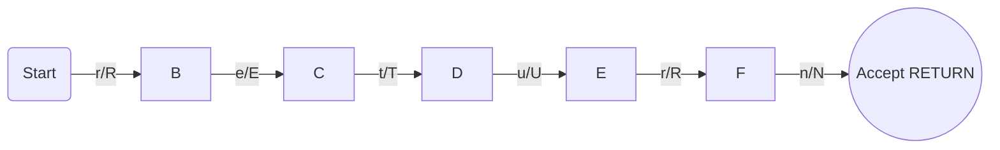

**Token:** NULL
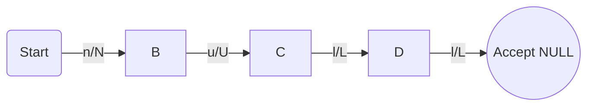

**Token:** ATH
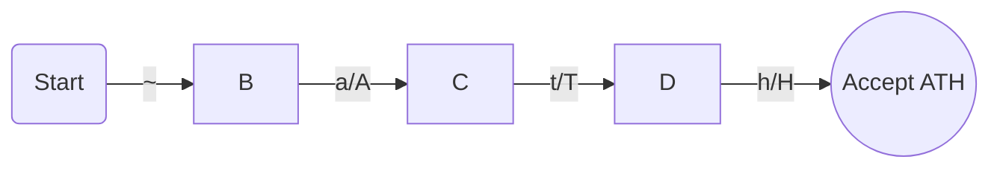

**Token:** EXECUTE
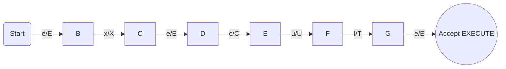

**Token:** THIS
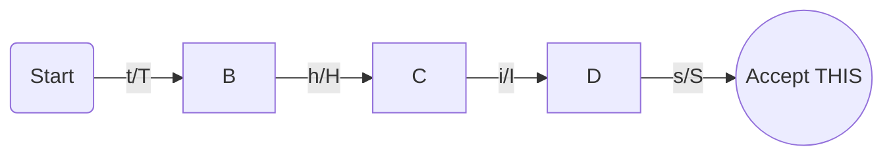

**Token:** SELF
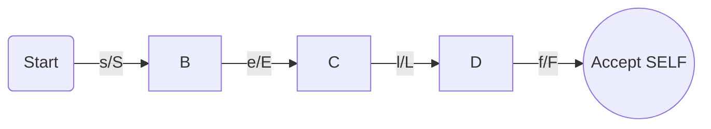

**Token:** IMPORT
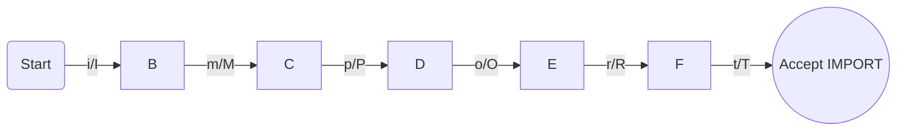

**Token:** INPUT
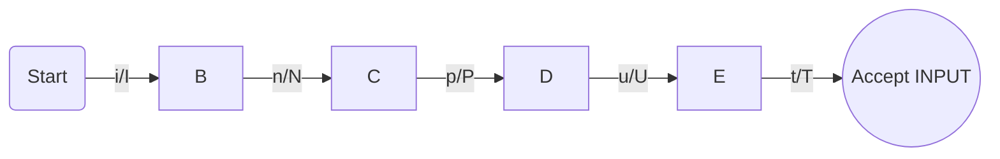

**Token:** LEND
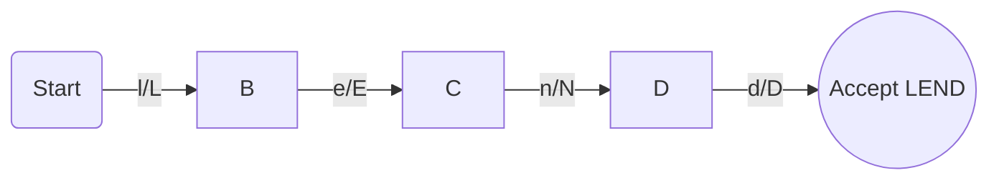

**Token:** CHAR
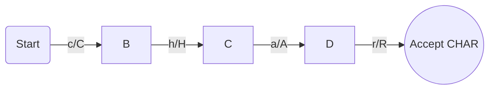

**Token:** ENTITY
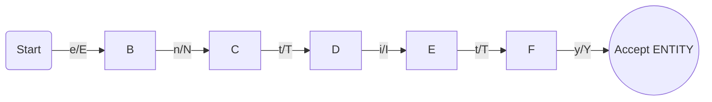

**Token:** ARRAY
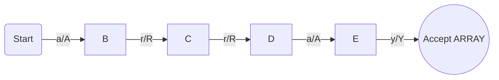

**Token:** INT
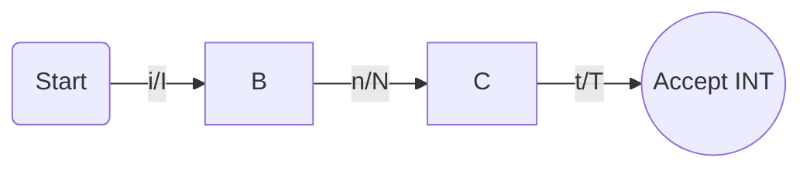

**Token:** FLOAT
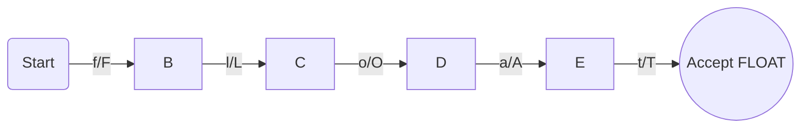

---

### Tipos e Literais

**Token:** LINT
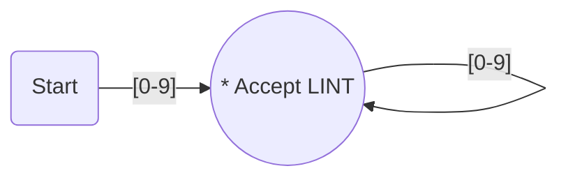


**Token:** LFLOAT
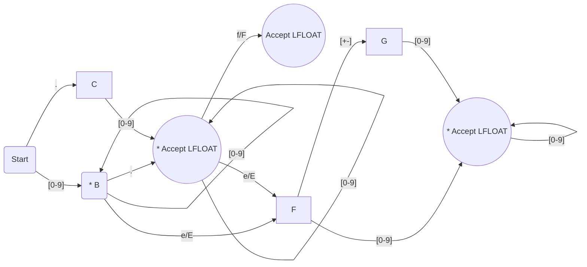


**Token:** LCHAR
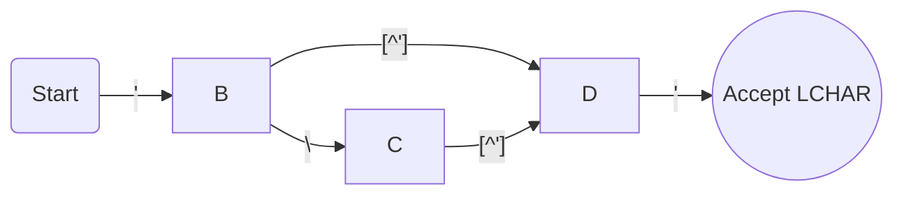


**Token:** LSTRING
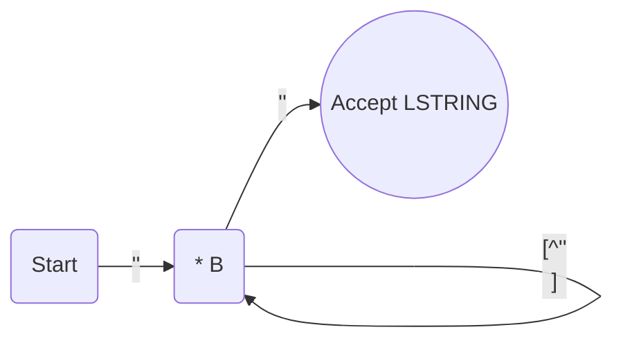
OBS: como o mermaid tem problemas como o caractere de aspas duplas, esse diagrama usa duas aspas simples como substituto.

**Token:** ID
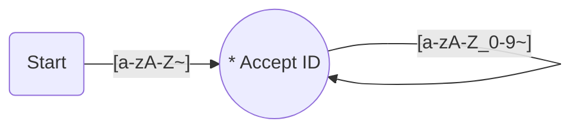

### Operadores relacionais e lógicos

**Token:** ISEQU
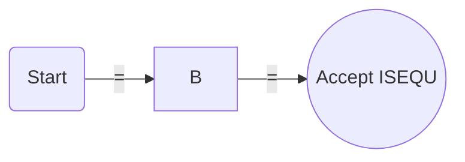

**Token:** ISDIF
```mermaid
graph LR;
A(Start) -- "!" --> B;
B -- "=" --> C((Accept ISDIF));
```

**Token:** LT
```mermaid
graph LR;
A(Start) -- "<" --> B((Accept LT));
```

**Token:** GT
```mermaid
graph LR;
A(Start) -- ">" --> B((Accept GT));
```

**Token:** LTE
```mermaid
graph LR;
A(Start) -- "<" --> B;
B -- "=" --> C((Accept LTE));
```

**Token:** GTE
```mermaid
graph LR;
A(Start) -- ">" --> B;
B -- "=" --> C((Accept GTE));
```

### Operadores de incremento e atribuição

**Token:** INC
```mermaid
graph LR;
A(Start) -- "+" --> B;
B -- "+" --> C((Accept INC));
```

**Token:** DEC
```mermaid
graph LR;
A(Start) -- "-" --> B;
B -- "-" --> C((Accept DEC));
```

**Token:** ATRIB
```mermaid
graph LR;
A(Start) -- "=" --> B((Accept ATRIB));
```

**Token:** SUMATRIB
```mermaid
graph LR;
A(Start) -- "+" --> B;
B -- "=" --> C((Accept SUMATRIB));
```

**Token:** SUBATRIB
```mermaid
graph LR;
A(Start) -- "-" --> B;
B -- "=" --> C((Accept SUBATRIB));
```

**Token:** MULATRIB
```mermaid
graph LR;
A(Start) -- "*" --> B;
B -- "=" --> C((Accept MULATRIB));
```

**Token:** DIVATRIB
```mermaid
graph LR;
A(Start) -- "/" --> B;
B -- "=" --> C((Accept DIVATRIB));
```

### Operadores aritméticos

**Token:** SUM
```mermaid
graph LR;
A(Start) -- "+" --> B((Accept SUM));
```

**Token:** SUB
```mermaid
graph LR;
A(Start) -- "-" --> B((Accept SUB));
```

**Token:** MUL
```mermaid
graph LR;
A(Start) -- "*" --> B((Accept MUL));
```

**Token:** DIV
```mermaid
graph LR;
A(Start) -- "/" --> B((Accept DIV));
```

### Operadores lógicos

**Token:** AND
```mermaid
graph LR;
A(Start) -- "&" --> B;
B -- "&" --> C((Accept AND));
```

**Token:** OR
```mermaid
graph LR;
A(Start) -- "|" --> B;
B -- "|" --> C((Accept OR));
```

**Token:** XOR
```mermaid
graph LR;
A(Start) -- "^" --> B;
B -- "^" --> C((Accept XOR));
```

**Token:** NOT
```mermaid
graph LR;
A(Start) -- "!" --> B((Accept NOT));
```

**Token:** ACCESS
```mermaid
graph LR;
A(Start) -- "-" --> B;
B -- ">" --> C((Accept ACCESS));
```

---

### Símbolos Especiais

**Token:** SCOLLON
```mermaid
graph LR;
A(Start) -- ";" --> B((Accept SCOLLON));
```

**Token:** COMMA
```mermaid
graph LR;
A(Start) -- "," --> B((Accept COMMA));
```

**Token:** PTOPEN
```mermaid
graph LR;
A(Start) -- "(" --> B((Accept PTOPEN));
```

**Token:** PTCLOSE
```mermaid
graph LR;
A(Start) -- ")" --> B((Accept PTCLOSE));
```

**Token:** BTOPEN
```mermaid
graph LR;
A(Start) -- "{" --> B((Accept BTOPEN));
```

**Token:** BTCLOSE
```mermaid
graph LR;
A(Start) -- "}" --> B((Accept BTCLOSE));
```

**Token:** SBOPEN
```mermaid
graph LR;
A(Start) -- "[" --> B((Accept SBOPEN));
```

**Token:** SBCLOSE
```mermaid
graph LR;
A(Start) -- "]" --> B((Accept SBCLOSE));
```

**Token:** COLLON
```mermaid
graph LR;
A(Start) -- ":" --> B((Accept COLLON));
```

---

