# ~ATH - COMPILADORES
### Integrantes
|Nome|Github|
|----|------|
|Allan Barros Cruz|[link](https://github.com/Alfabeto-Allan)|
|Bruno Emanoel|[link]([github.com](https://github.com/Bruno-Emanoel))|
|Cecília Brito|[link](https://github.com/cecilia-brito)|

### Sumário

- [~ATH - COMPILADORES](#ath---compiladores)
    - [Integrantes](#integrantes)
    - [Sumário](#sumário)
  - [Resumo](#resumo)
  - [Introdução](#introdução)
      - [exemplo 1](#exemplo-1)
  - [Estrutura da linguagem](#estrutura-da-linguagem)
    - [Blocos de Ciclo](#blocos-de-ciclo)
      - [exemplo 2](#exemplo-2)
    - [Entidades (ENTITY)](#entidades-entity)
      - [Entidade Principal](#entidade-principal)
        - [Bloco de Importação](#bloco-de-importação)
          - [Exemplo de importação](#exemplo-de-importação)
        - [Bloco de Entidade](#bloco-de-entidade)
          - [Exemplo de Bloco de Posse](#exemplo-de-bloco-de-posse)
      - [Entidade Posse](#entidade-posse)
        - [Exemplo de Entidade Posse](#exemplo-de-entidade-posse)
      - [Entidade Composta](#entidade-composta)
      - [Entidade imediata](#entidade-imediata)
        - [Exemplo de entidade imediata](#exemplo-de-entidade-imediata)
    - [Instruções de controle de ciclo](#instruções-de-controle-de-ciclo)
    - [Comandos e Operações](#comandos-e-operações)
    - [Valores e referências](#valores-e-referências)
      - [Referências primitivas](#referências-primitivas)
      - [Cópias de entidades](#cópias-de-entidades)
    - [EXECUTE](#execute)
  - [Lexemas e Tokens](#lexemas-e-tokens)
    - [Palavras Reservadas](#palavras-reservadas)
    - [Operadores](#operadores)
    - [Separadores](#separadores)
    - [Literais](#literais)
    - [Identificadores (Posses)](#identificadores-posses)
  - [Estrutura do projeto](#estrutura-do-projeto)
  - [Teste e Exemplos](#teste-e-exemplos)
  - [Regras de Transição (em Mermaid)](#regras-de-transição-em-mermaid)
    - [Palavras Reservadas](#palavras-reservadas-1)
    - [Tipos e Literais](#tipos-e-literais)
    - [Operadores relacionais e lógicos](#operadores-relacionais-e-lógicos)
    - [Operadores de incremento e atribuição](#operadores-de-incremento-e-atribuição)
    - [Operadores aritméticos](#operadores-aritméticos)
    - [Operadores lógicos](#operadores-lógicos)
    - [Símbolos Especiais](#símbolos-especiais)

## Resumo

Este projeto mantém a implementação da `~ATH` ("Til Death"), uma linguagem de programação de paradigma imperativo e com sistema de tipos estático, desenvolvida para a disciplina de Compiladores - MATA61 da UFBA - Universidade Federal da Bahia. A característica principal da linguagem está em sua estruturação "orientada a loops", ou "orientada a ciclos de vida", na qual a principal estrutura de controle de fluxo é implementada através de uma construção iterativa que persiste realizando uma mesma ação enquanto uma condição ou entidade vinculada a ela mantiver um estado "ativo" ou "vivo".

Estado do Projeto: O projeto está em fase de concepção da linguagem e planejamento da implementação do analisador léxico.

## Introdução

A linguagem `~ATH` é inspirada em uma linguagem de programação ficticia de mesmo nome presente na webcomic "Homestuck". Sua estrutura principal é um constructo de interação baseado na "vida" de valores variáveis dentro de um programa. Abaixo está um exemplo de um código mínimo de `~ATH`:
#### exemplo 1
```~ATH
~ATH() {

} EXECUTE (NULL);

THIS->DIE();
```

A palavra chave `~ATH` define um "ciclo" ou "loop" de maneira análoga a linguagens tradicionais. Dentro dos parênteses seguintes é possível "vincular" algum valor ou objeto da linguagem cujo estado será checado ao final de cada iteração deste ciclo. Dentro das chaves é aceito código com a mesma estrutura representada. 

Ao final, quando o estado do objeto vinculado ao ciclo for reconhecido como "inativo" ou "morto", então não será realizada uma nova execução, e será feita uma chamada para uma função pelo campo `EXECUTE` ao fim do loop, nesse caso nada será executado, evidenciado pela palavra reservada `NULL`. Por fim, `THIS->DIE()` é uma boa prática para finalização do programa.

## Estrutura da linguagem

`~ATH` é uma linguagem imperativa, orientada a ciclos de vida, estaticamente tipada e modularizável. Sua estrutura principal é similar a "loops" em linguagens tradicionais, utilizando a palavra chave `~ATH`, de forma que qualquer operação não declarativa deve ser executada em formato de laço de repetição, mesmo que ela deva ser realizada uma única vez.

Para esta linguagem, o programa e sua execução são considerados entidade e ciclo de vida, respectivamente. Os valores armazenados para utilização no programa são chamados "posses", podendo ser números (`int` ou `float`), caractéres (`char`), texto (`string`) ou até mesmo outras entidades (`entity`) com seus próprios ciclos de vida e posses.

> As palavras chave da linguagem são reconhecidas independente da caixa da letra, ou seja, `int`, é o mesmo que `INT`, que o mesmo que `Int`, etc.

### Blocos de Ciclo

No [exemplo 1](#exemplo-1) está um exemplo da estrutura básica de ~ATH. Essa estrutura será chamada `Bloco de ciclo` e possui a estrutura genérica seguinte:

#### exemplo 2
```~ATH
~ATH( ENTIDADE ) {
    CICLO;
} EXECUTE ( FINALIZAR );

THIS->DIE();
```

Neste exemplo, **ENTIDADE** representa qualquer expressão, literal ou variável. Na primeira execução e no começo de cada uma após esta, **ENTIDADE** será avaliada e será interpretada como um valor binário que será vivo (`alive`) ou morto (`dead`). 

No primeiro caso, **CICLO** será executado, onde **CICLO** se tratá de qualquer `Bloco de Ciclo` de válido. Ao terminar a execução de ciclo (e caso nenhuma instrução de controle de ciclo seja executada) **ENTIDADE** será avaliada novamente e isso se repetirá enquanto seu valor não for avaliado como `dead` ou enquanto **CICLO** não utilizar um comando de controle de ciclo.

Caso **ENTIDADE** seja avaliada como `dead`, **CICLO** não será executado e então o programa irá progredir para a etapa de terminação, ou *Execução*, do ciclo, evidenciada pela palavra-chave `EXECUTE`. Esta etapa recebe uma *entidade composta ou imediata* como argumento e irá executar seu ciclo de vida uma única vez durante a etapa de execução.

Após a terminação e execução de um ciclo, é permitido o uso de uma única [Instrução de controle de ciclo](#instruções-de-controle-de-ciclo) opcional. Esse tipo de instrução é responsável por redirecionar a execução do programa de maneira a modificar o ciclo padrão descrito acima. Essas instruções são acessadas através das entidades especiais `THIS` e `SELF`, seguidas pelo operador de acesso `->` e então um dos métodos de controle: `DIE`, `EXEC` ou `SLEEP`.

### Entidades (ENTITY)

Entidades são os constructos principais de `~ATH`, elas possuem a capacidade de guardar dados em suas posses e possuem seu próprio ciclo de vida. O próprio programa principal de `~ATH` se trata de uma entidade. Devido a sua importância, existem diferentes tipos de Entidades. 

#### Entidade Principal

Se trata do programa principal escrito em um arquivo `.ath`. e pode ser divido em 2 blocos (1 bloco e 2 sub-blocos, mais precisamente): [Bloco de Importação](#bloco-de-importação) e [Bloco de Entidade](#bloco-de-entidade). 

##### Bloco de Importação

Este bloco se refere às requisições de módulos externos ou internos para utilização no programa. `~ATH` possui entidades construidas internamente para operações como comunicação no terminal ou acesso a arquivos que podem ser importadas. Além disso, é possível importar outros arquivos `.ath` locais para utilização de suas entidades no programa.

Para realizar importações são utilizadas duas palavras-chave: `IMPORT` e `AS`. A primeira é a mais importante e obrigatória para realizar um importação, indicando que um comando de importação está sendo declarado. A segunda indica que a Entidade importa está sendo declarada com um novo nome para este ciclo. A estrutura geral segue a estrutura de `IMPORT MODULO AS NAME` onde **MODULO** se refere ao nome ou caminho do módulo importado e **NAME** é o nome que será atribuido a essa entidade no programa.

> Em caso de importação de outros arquivos locais, caso não seja utilizada a palavra-chave `AS` para nomear a ENTIDADE importada, então o nome atribuido será o nome do arquivo .ath sem a terminação de arquivo e descartando todos os caracteres inválidos para nomeação de posses. Ex: `IMPORT "./other.ath"` terá seu ciclo importado e acessível através do nome *other* e `IMPORT "./1a.ath"` receberá o nome *a*. O compilador deverá alertar erro em caso de nomes vazios ou repetidos.

É também possível importar apenas Entidades Posse do módulo importado utilizando chaves (`{}`). Por exemplo, se o módulo Console possui Entidades Posse chamadas ReadLine e Print mas apenas se deseja utilizar a Entidade Print, então se utilizaria `IMPORT Console { Print };`, sendo possível utilizar a palavra chava `AS` dentro das chaves para nomear a Entidade Posse importada como no [Exemplo abaixo](#exemplo-de-importação).

###### Exemplo de importação

```~ATH
IMPORT Universe;
IMPORT Particle AS Meson 
IMPORT Console{ ReadLine AS Read, Print }; 
IMPORT "./other.ath"
IMPORT "./yetanother.ath" AS Another
```

##### Bloco de Entidade

Blocos de Entidade são compostos de dois sub-blocos, exatamente na ordem: `Bloco de Posses` e [`Bloco de Ciclos`](#blocos-de-ciclo).

`Blocos de Posses` são onde as `posses` de uma entidade são declaradas. Ele é composto por uma sequência de **declaração de posses** que seguem o formato: `TIPO NOME = EXPRESSAO;` ou **declaração de entidade** no formato: 

```~ATH
NOME:
    BLOCO DE ENTIDADE
```

Declarações de posse devem possuir nomes consistindo de caracteres alfanuméricos maiúsculos ou maiúsculos ([a-zA-Z0-9]), undersecore (_) ou til (\~), podendo ser iniciadas apenas por letras ou til. Não é permitido a redeclaração de posses em uma mesma entidade.

**EXPRESSÕES** válidas consistem de literais, variáveis, chamadas de ciclos ou operações entre expressões válidas. Também é possível utilizar as palavras-chave `INPUT` e `RETURN` como atribuições de uma posse. `INPUT` indica que esta posse deve será inicializada com um valor fornecida no momento que a entidade for inicializada ou "chamada". Apenas uma posse deve ser atribuida como `RETURN`, e indicará o valor fornecido pela chamada de ciclo.

###### Exemplo de Bloco de Posse

```~ATH
INT val = INPUT;
STRING nome = "Til Death";
Ciclo:
    INT outroValor = INPUT;
    INT devolver = RETURN;
    ~ATH(){} EXECUTE( devolver = outroValor + 5; );

    SELF->DIE();

CHAR inicial = '~';
INT execucao = Ciclo( 10 ); // 15
```

> Declaração de um inteiro, uma string, uma entidade e um caractere. Além disso, o ciclo chamado Ciclo tem a posse do tipo INT chamada outroValor que terá seu valor recebido como entrada e outra posse que será o "retorno" de sua execução. Na última linha é criada uma posse cujo valor será o retorno da chamada realizada com o valor 10, que retornará este valor + 5, 15.

> Em um bloco de Entidade, todo uso da palavra-chave `THIS` irá se referia a entidade indicada por este bloco. O uso da palavra-chave `SELF` irá se referir à entidade vinculada ao ciclo atual.

#### Entidade Posse

Uma `Entidade Posse` é simplesmente uma entidade declarada como posse de outra. É possível ver um exemplo [na seção anterior](#exemplo-de-bloco-de-posse). Como visto, para declara um Entidade posse é apenas necessário fornecer o nome da entidade e indicar com dois pontos (:) que sua especificação será dada em sequência. A identação é opcional, mas considerada um boa prática. O fim da declaração da entidade de posse será considerado o fim do [bloco de ciclo](#blocos-de-ciclo) da mesma.

É possível utilizar as Entidades Posse como módulos internos ou argumentos de execução. Para utilizar o ciclo de uma entidade são utilizados parenteses (`()`) onde deverão estar listados em ordem os valores fornecidos para as posses de `INPUT`. Essa execução é considerada uma expressão e assumirá o valor na posse atribuida como `RETURN`, ou `NULL` caso não exista nenhuma.

Entidades de posse não tem acesso a qualquer posse externa não fornecida como input. Porém, suas posses podem ser acessadas atavés do operador de acesso (`->`). Acessar posses antes de serem inicializadas é considerado como tendo comportamento indefinido, seu código deve ter inicializar as posses antes de serem acessadas para evitar esse tipo de comportamento.

##### Exemplo de Entidade Posse
```~ATH
saudacao:
    string prefixo = "Olá ";
    string nome = INPUT;
    string ret = RETORNO;
    ~ATH(){
    } EXECUTE ( ret = Prefixo + nome ;);

    THIS->DIE();

string texto = saudacao( "Mundo" );

~ATH(){} EXECUTE ( NULL );

THIS->DIE();
```

> Cria uma entidade posse chamada saudacao, que recebe um nome e retornará uma string. após terminar a declaração dessa entidade, é criada a posse texto que receberá a string retornada por saudação com o input "Mundo", nesse caso "Olá Mundo".

#### Entidade Composta

Ao definir uma entidade de posse, é definido um certo número de inputs de acordo com as posses atribuidas com a palavra-chave `INPUT`. É possível fixar inputs de uma entidade e guardar seus estados utilizando a composição. 

No [exemplo de entidade de posse](#exemplo-de-entidade-posse), a entidade Saudacao possui uma posse chamada prefixo inicializada com "Olá " que será inicializada antes mesmo de um input ser fornecido e pode ser acessada externamente com a sintaxe `Saudacao->prefixo`. Caso houvesse uma outra posse declarada após a posse nome, ela não seria inicializada até que o input nome fosse fornecido e caso houvesse mais uma sequencia de `INPUT` seguida por uma posse fixa, então essa última posse só seria inicializada após o último input ser fornecido.

Esse conceito é importante pois é possível fornecer apenas alguns argumentos de input para uma entidade sem chamar seu ciclo. Isso é chamado em ~ATH de `Entidade Composta`, ou `Composição de Entidade`. Para isso, ao invés dos parenteses se utiliza chaves (`{}`) para fornecer valores para as posses de input e criar uma nova entidade a partir da original, criando uma nova entidade do tipo `ENTITY[ENTIDADE_ORIGINAL]`, onde **ENTIDADE_ORIGINAL** se refere a entidade posse que será composta. No exemplo citado, poderiamos definir novas entidades compostas da seguinte forma:

```~ATH
entity[saudacao] oiMundo = saudacao{ "Mundo" };
entity[saudacao] oiOutroMundo = oiMundo{};
entity[saudacao] ola = saudacao{};

oiMundo();      // "Olá mundo"
oiOutroMundo(); // "Olá mundo"
ola( "Mundo" ); // "Olá mundo"
ola();          // ERRO: parâmetros insuficientes.
```

> São criadas três novas entidades, uma chamada oiMundo que será o mesmo que a entidade saudacao, porém sua primeira posse de input receberá o valor "Mundo". Em seguida é criada a posse oiOutroMundo que é essencialmente uma cópia de oiMundo, pois não são fornecidos novos argumentos de composição. E então é criada uma cópia da entidade de posse saudacao, esta necessitando de um parâmetro para se chamada.

A composição de entidades permite fazer a cópia do estado atual de uma entidade, assim como armazenar valores e criar estruturas de armazenamento mais complexas. No exemplo acima, seria possível acessar em todas as entidades posses criadas a posse prefixo, por ex: `oiMundo->prefixo`, enquanto apenas para as duas primeiras seria possível acessar (com segurança) o valor da posse nome, por ex: `oiOutroMundo->nome`.

#### Entidade imediata

Entidades Imediatas consistem de Entidades que não possuem posses e são declaradas dentro de um bloco de ciclo, sendo elas mesma definidas apenas por um bloco de ciclo. Ao executar o ciclo de uma Entidade Imediata, a palavra-chave `SELF` irá indicar esta entidade, sendo possível terminar sua execução através dos métodos especiais `DIE` ou `EXECUTE`.

##### Exemplo de entidade imediata
```~ATH
// Entidade principal
~ATH() {
    // Entidade imediate
    ~ATH() {

        SELF->DIE(); // Se refere à entidade imediata
    } EXECUTE ( NULL );

    SELF->DIE(); // Se refere à entidade principal
} EXECUTE ( NULL );
```

> Não é possível atribuir uma entidade imediata a uma posse.

### Instruções de controle de ciclo

Instruções de controle de ciclo são métodos especiais que são acessíveis através das palavras-chave `SELF` e `THIS` para modificar o fluxo do ciclo atual. `SELF` representa o ciclo mais interno que está sendo executado, como visto no [exemplo anterior](#exemplo-de-entidade-imediata), e pode ser utilizado para referenciá-lo. `THIS` se refere ao ciclo mais externo sendo executado, sendo que qualquer uso da palavra-chave `THIS` em uma entidade posse irá se referir a própria entidade, enquanto caso seja utilizada na Entidade Principal, irá se referir a ela.

Os métodos especiais, acessíveis através do operador de acesso (`->`) são: `DIE`, `EXEC` e `SLEEP`, cada um com sua própria especificação:

* `DIE`: "Mata" a entidade, fazendo com que ela seja considerada "morta" (`dead`) caso vinculada a um ciclo e não realizando o seu comando EXECUTE.
* `EXEC`: Realiza o comando `EXECUTE` do ciclo e apenas então "Mata" a entidade, fazendo com que ela seja considerada "morta" (`dead`) caso vinculada a um ciclo.
* `SLEEP`: Interrompe o ciclo e simplesmente retorna. A entidade continuará considerada "viva" (`alive`) e seus valores modificados serão preservados.

> Apesar de não ser obrigatório o uso do `THIS->DIE()` para finalização de uma entidade, é considerada uma boa prática.

### Comandos e Operações

Como explicitado na [tabela de operadores](#operadores), a linguagem ~ATH possui diversas operações que podem ser realizadas, sendo elas:

* **Aritméticas**: Soma `+`, Subtração `-`, Multiplicação `*`, Divisão `/`, Incremento `++`, Decremento `--`
* **Lógicas**: "E" `&&`, "Ou" `||`,"Não" `!`, "Ou exclusivo" `^^`
* **Comparação**: Igualdade `==`, Desigualdade `!=`, Maior `>`, Menor `<`, Maior ou igual `>=`, Menor ou igual `<=`
* **Atribuição**: Atribuir `=`, Atribuição com soma `+=`, Atribuição com Subtração `-=`,Atribuição com Multiplicação `*=`, Atribuição com Divisão `/=`

### Valores e referências

Em ~ATH todos os tipos primitivos (int, float, char, string e null) são copiados e passados por valor ao atribuir e passar como argumentos, porém entidades são sempre passadas por referência. Isso significa que ao passar uma entidade como input, caso ela seja modificada dentro do ciclo de vida da entidade executada então a entidade original também será modificada. 

#### Referências primitivas

Para poder utilizar tipos primitivos como referência, é necessário utilizar a palavra chave `LEND` ao passar uma posse de tipo primitivo como input. Ex:

```~ATH
somaDois:
    INT num = INPUT;

    ~ATH(){

    } EXECUTE( num += 2; );

    THIS->DIE();

INT meuVal = 5;

~ATH(){

} EXECUTE ( somaDois{ LEND meuVal } ); // meuVal passará a ser 7

THIS->DIE();
```

#### Cópias de entidades

Para copiar uma entidade, basta utilizar a composição vazia, que criará uma copia da entidade original. Ex:

```~ATH
// entidade e parâmetros genêricos
ENTITY[ORIGINAL] primeiro = ORIGINAL{...}; 
ENTITY[ORIGINAL] segundo = primeiro{};      // Copia
```

### EXECUTE

O comando de EXECUTE irá terminar um ciclo, chamando uma entidade terminadora ou executando um único comando arbitrário. O que está dentro dos parênteses do EXECUTE será executado assim que a execução do código chegar àquele ponto, e então o programa irá tentar executar o resultado da expressão. Caso o desejado seja executar uma única chamada de uma entidade *A*, então deve-se fazer `...} EXECUTE ( A{} ); `, pois a expressão `A{}` será avaliado e então seu resultado executado.

No exemplo acima, caso estivesse `EXECUTE ( A() );`, então a expressão `A()` seria avaliada e então seu retorno seria chamado, se possível. Caso o retorno sejá de um tipo primitivo diferente de NULL, ocorrerá um erro. 

Expressões de atribuição são válidas dentro de um EXECUTE, pois não possuem retorno (`NULL`).

## Lexemas e Tokens

### Palavras Reservadas

| Categoria | Token | Lexema | Descrição |
|-----------|-------|--------|-----------|
| Controle de Ciclo | `<~ATH>` | `~ATH` | Indica o início de um "ciclo de vida" ou "loop" |
| Controle de Ciclo | `<EXECUTE>` | `EXECUTE` | Indica o fim de um "ciclo de vida" e a ação que será executada ao seu término |
| Controle de Ciclo | `<THIS>` | `THIS` | Se refere ao escopo global do programa |
| Controle de Ciclo | `<SELF>` | `SELF` | Se refere ao escopo local do programa, ou o "ciclo" atual |
| Valores Especiais | `<NULL>` | `NULL` | Entidade vazia, pode ser chamada como "função" mas não realiza nenhuma ação |
| Modularidade | `<IMPORT>` | `IMPORT` | Importa outros módulos ou constructos da biblioteca padrão |
| Modularidade | `<AS>` | `AS` | Nomeia um módulo importado |
| Referência | `<LEND>` | `LEND` | Toma a referência de um valor |
| Funções | `<INPUT>` | `INPUT` | Define uma posse de um ciclo como "entrada" ou "argumento" |
| Funções | `<RETURN>` | `RETURN` | Define uma posse de um ciclo como "saída" ou "retorno" |
| Tipos | `<INT>` | `INT` | Palavra chave para identificar tipagem de variável como valor inteiro |
| Tipos | `<FLOAT>` | `FLOAT` | Palavra chave para identificar tipagem de variável como valor de ponto flutuante |
| Tipos | `<CHAR>` | `CHAR` | Palavra chave para identificar tipagem de variável como valor de caractere |
| Tipos | `<STRING>` | `STRING` | Palavra chave para identificar tipagem de variável como valor de string ou texto |
| Tipos | `<ARRAY>` | `ARRAY` | Palavra chave para identificar tipagem de variável como valor composto de diversos tipos |
| Tipos | `<ENTITY>` | `ENTITY` | Palavra chave para identificar tipagem de variável como valor complexo que pode ser executado como ciclo próprio |

### Operadores

| Token | Lexema | Descrição |
|-------|--------|-----------|
| `<ATRIB>` | `=` | Operador de atribuição |
| `<SUMATRIB>` | `+=` | Operador de atribuição com soma |
| `<SUBATRIB>` | `-=` | Operador de atribuição com subtração |
| `<MULATRIB>` | `*=` | Operador de atribuição com multiplicação |
| `<DIVATRIB>` | `/=` | Operador de atribuição com divisão |
| `<SUM>` | `+` | Operador de soma |
| `<SUB>` | `-` | Operador de subtração |
| `<INC>` | `++` | Operador de incremento |
| `<DEC>` | `--` | Operador de decremento |
| `<MUL>` | `*` | Operador de multiplicação |
| `<DIV>` | `/` | Operador de divisão |
| `<ACCESS>` | `->` | Operador de acesso |
| `<ISEQU>` | `==` | Operador de "igual à" |
| `<ISDIF>` | `!=` | Operador de "diferente de" |
| `<LT>` | `<` | Operador de "menor que" |
| `<GT>` | `>` | Operador de "maior que" |
| `<LTE>` | `<=` | Operador de "menor ou igual" |
| `<GTE>` | `>=` | Operador de "maior ou igual" |
| `<OR>` | `\|\|` | Operador de "Ou" lógico |
| `<AND>` | `&&` | Operador de "E" lógico |
| `<NOT>` | `!` | Operador de "Não" lógico |
| `<XOR>` | `^^` | Operador de "Ou exclusivo" lógico |

### Separadores

| Token | Lexema | Descrição |
|-------|--------|-----------|
| `<SCOLLON>` | `;` | Delimitador de expressões |
| `<COLLON>` | `:` | Indicador de ciclo interno |
| `<COMMA>` | `,` | Separador de argumentos |
| `<DOT>` | `.` | Operador de acesso especial |
| `<PTOPEN>` | `(` | Delimitador de expressão (abertura) |
| `<PTCLOSE>` | `)` | Delimitador de expressão (fechamento) |
| `<SBOPEN>` | `[` | Especificador de array (abertura) |
| `<SBCLOSE>` | `]` | Especificador de array (fechamento) |
| `<BTOPEN>` | `{` | Delimitador de composição (abertura) |
| `<BTCLOSE>` | `}` | Delimitador de composição (fechamento) |

### Literais

| Token | Lexema | Descrição | Exemplo |
|-------|--------|-----------|---------|
| `<LINT>` | Números inteiros | Números inteiros literais, com suporte para decimal, binário, octal e hexadecimal | `<LINT, 123>` |
| `<LFLOAT>` | Números com casa decimal | Números com casa decimal ou notação científica | `<LFLOAT, 1.2>` |
| `<LCHAR>` | Caracteres entre aspas simples | Caracter normal ou especial (escapado) entre aspas simples | `<LCHAR, 'c'>` |
| `<LSTRING>` | Sequência de caracteres | Sequência de caracteres entre aspas duplas | `<LSTRING, "alo">` |

### Identificadores (Posses)

| Token | Lexema | Descrição | Padrão |
|-------|--------|-----------|--------|
| `<ID>` | Identificadores | Variáveis em `~ATH`, devem começar com uma letra ou til(~) e são formados por letras, dígitos, underscore (_) ou til (~) | `[a-zA-Z~][a-zA-Z0-9_~]*` |

## Estrutura do projeto

## Teste e Exemplos

## Regras de Transição (em Mermaid)

### Palavras Reservadas

**Token:** RETURN
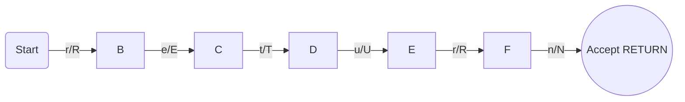

**Token:** NULL
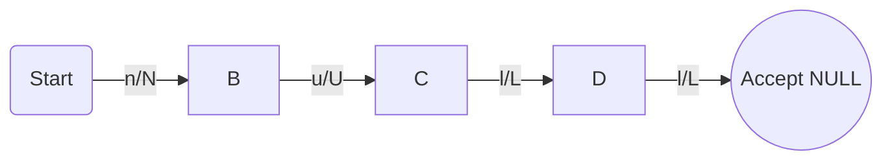

**Token:** ATH
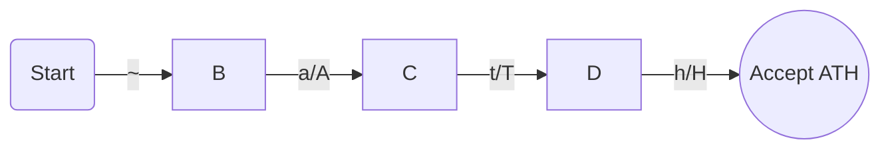

**Token:** EXECUTE
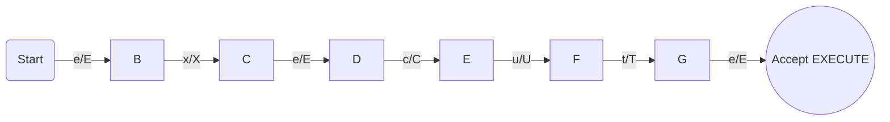

**Token:** THIS
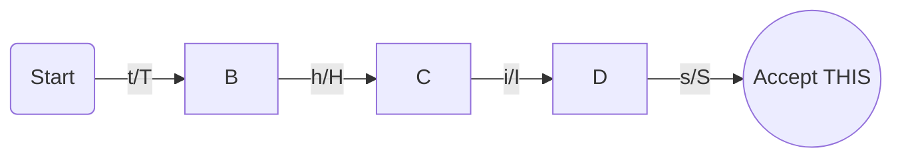

**Token:** SELF
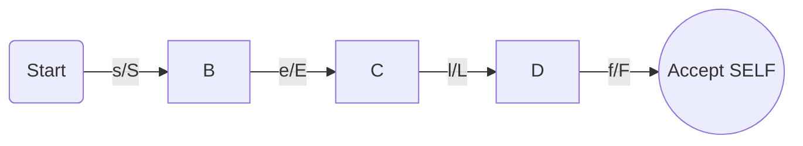

**Token:** IMPORT
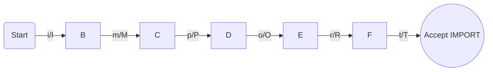

**Token:** INPUT
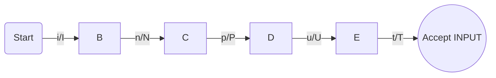

**Token:** LEND
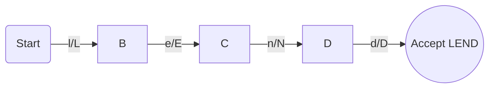

**Token:** CHAR
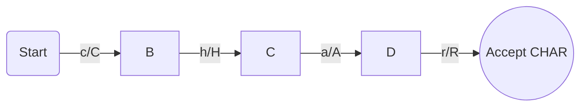

**Token:** ENTITY
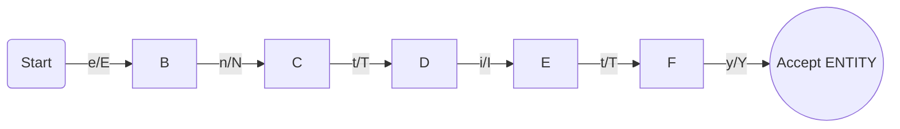

**Token:** ARRAY
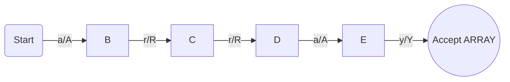

**Token:** INT
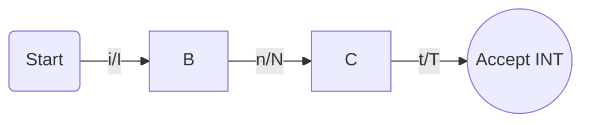

**Token:** FLOAT
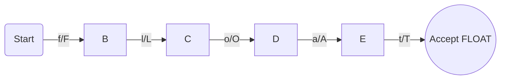

---

### Tipos e Literais

**Token:** LINT
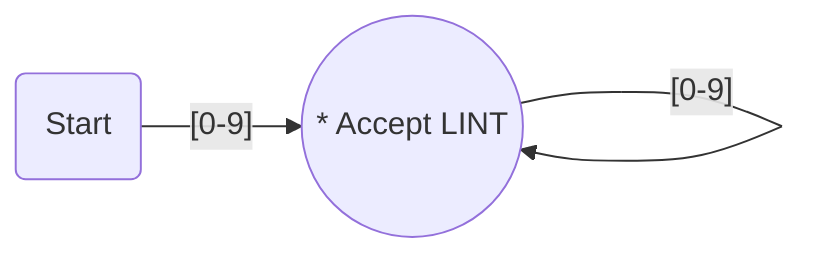


**Token:** LFLOAT
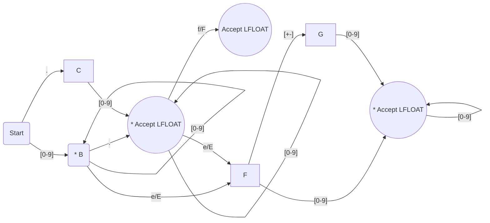


**Token:** LCHAR
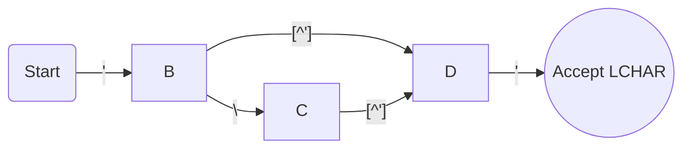


**Token:** LSTRING
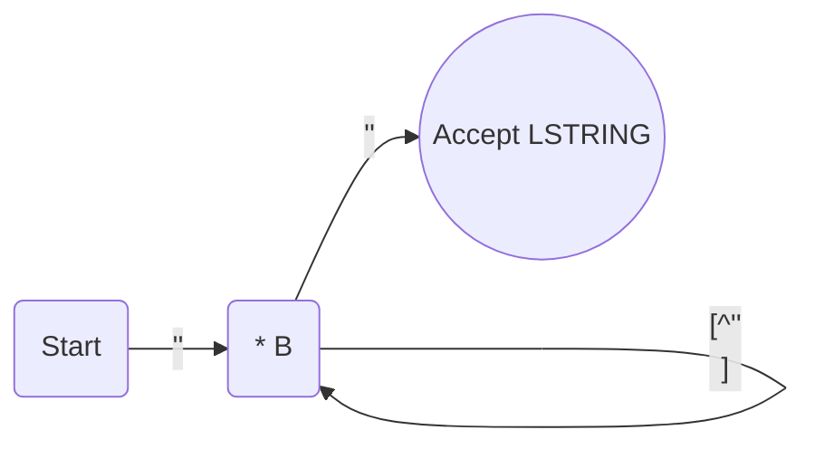
OBS: como o mermaid tem problemas como o caractere de aspas duplas, esse diagrama usa duas aspas simples como substituto.

**Token:** ID
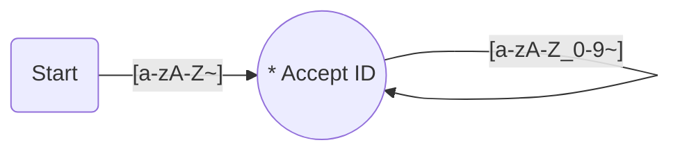

### Operadores relacionais e lógicos

**Token:** ISEQU
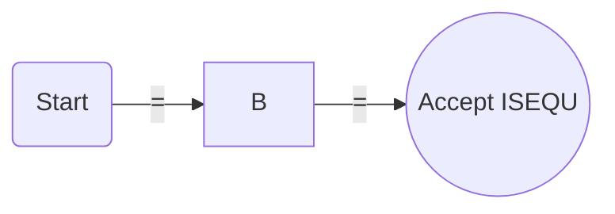

**Token:** ISDIF
```mermaid
graph LR;
A(Start) -- "!" --> B;
B -- "=" --> C((Accept ISDIF));
```

**Token:** LT
```mermaid
graph LR;
A(Start) -- "<" --> B((Accept LT));
```

**Token:** GT
```mermaid
graph LR;
A(Start) -- ">" --> B((Accept GT));
```

**Token:** LTE
```mermaid
graph LR;
A(Start) -- "<" --> B;
B -- "=" --> C((Accept LTE));
```

**Token:** GTE
```mermaid
graph LR;
A(Start) -- ">" --> B;
B -- "=" --> C((Accept GTE));
```

### Operadores de incremento e atribuição

**Token:** INC
```mermaid
graph LR;
A(Start) -- "+" --> B;
B -- "+" --> C((Accept INC));
```

**Token:** DEC
```mermaid
graph LR;
A(Start) -- "-" --> B;
B -- "-" --> C((Accept DEC));
```

**Token:** ATRIB
```mermaid
graph LR;
A(Start) -- "=" --> B((Accept ATRIB));
```

**Token:** SUMATRIB
```mermaid
graph LR;
A(Start) -- "+" --> B;
B -- "=" --> C((Accept SUMATRIB));
```

**Token:** SUBATRIB
```mermaid
graph LR;
A(Start) -- "-" --> B;
B -- "=" --> C((Accept SUBATRIB));
```

**Token:** MULATRIB
```mermaid
graph LR;
A(Start) -- "*" --> B;
B -- "=" --> C((Accept MULATRIB));
```

**Token:** DIVATRIB
```mermaid
graph LR;
A(Start) -- "/" --> B;
B -- "=" --> C((Accept DIVATRIB));
```

### Operadores aritméticos

**Token:** SUM
```mermaid
graph LR;
A(Start) -- "+" --> B((Accept SUM));
```

**Token:** SUB
```mermaid
graph LR;
A(Start) -- "-" --> B((Accept SUB));
```

**Token:** MUL
```mermaid
graph LR;
A(Start) -- "*" --> B((Accept MUL));
```

**Token:** DIV
```mermaid
graph LR;
A(Start) -- "/" --> B((Accept DIV));
```

### Operadores lógicos

**Token:** AND
```mermaid
graph LR;
A(Start) -- "&" --> B;
B -- "&" --> C((Accept AND));
```

**Token:** OR
```mermaid
graph LR;
A(Start) -- "|" --> B;
B -- "|" --> C((Accept OR));
```

**Token:** XOR
```mermaid
graph LR;
A(Start) -- "^" --> B;
B -- "^" --> C((Accept XOR));
```

**Token:** NOT
```mermaid
graph LR;
A(Start) -- "!" --> B((Accept NOT));
```

**Token:** ACCESS
```mermaid
graph LR;
A(Start) -- "-" --> B;
B -- ">" --> C((Accept ACCESS));
```

---

### Símbolos Especiais

**Token:** SCOLLON
```mermaid
graph LR;
A(Start) -- ";" --> B((Accept SCOLLON));
```

**Token:** COMMA
```mermaid
graph LR;
A(Start) -- "," --> B((Accept COMMA));
```

**Token:** PTOPEN
```mermaid
graph LR;
A(Start) -- "(" --> B((Accept PTOPEN));
```

**Token:** PTCLOSE
```mermaid
graph LR;
A(Start) -- ")" --> B((Accept PTCLOSE));
```

**Token:** BTOPEN
```mermaid
graph LR;
A(Start) -- "{" --> B((Accept BTOPEN));
```

**Token:** BTCLOSE
```mermaid
graph LR;
A(Start) -- "}" --> B((Accept BTCLOSE));
```

**Token:** SBOPEN
```mermaid
graph LR;
A(Start) -- "[" --> B((Accept SBOPEN));
```

**Token:** SBCLOSE
```mermaid
graph LR;
A(Start) -- "]" --> B((Accept SBCLOSE));
```

**Token:** COLLON
```mermaid
graph LR;
A(Start) -- ":" --> B((Accept COLLON));
```

---
